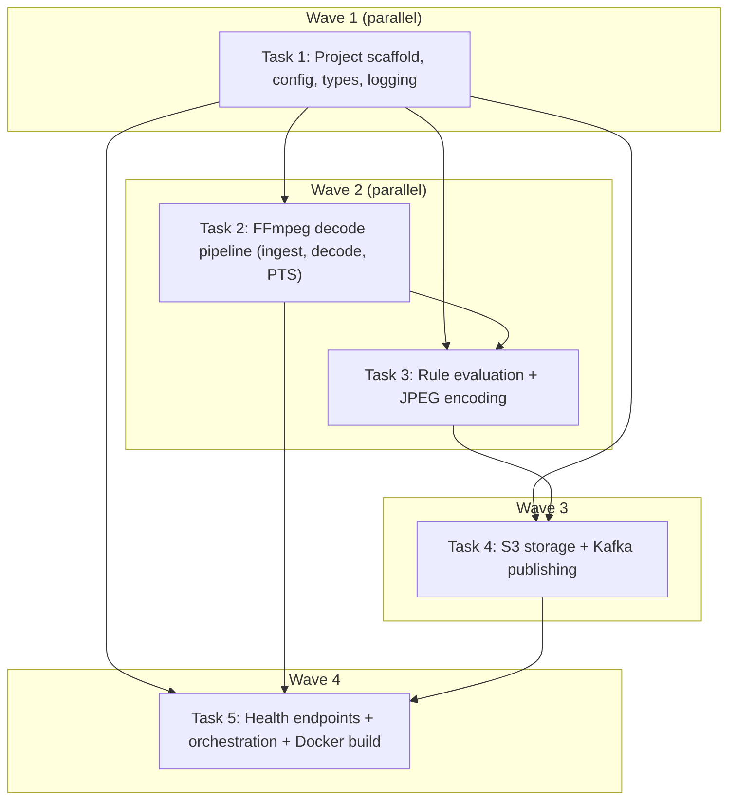

<objective>
**Phase 1 End-to-End:** Build the complete single-stream video frame extraction pipeline — ingest a video source (RTSP/RTMP/HLS/file) via FFmpeg libavcodec as a library, decode H.264 frames in a raw `avcodec_send_packet`/`receive_frame` loop with PTS reordering and keyframe alignment, evaluate a fixed-interval extraction rule, encode matching frames as JPEG (via yuvutils-rs YUV→RGB SIMD + image crate), upload to MinIO/S3 with deterministic keys (claim-check pattern), and publish frame metadata to Kafka as JSON. Include YAML configuration, structured JSON logging (tracing), Axum health check endpoints, graceful shutdown, and a Docker multi-stage build producing a distroless image with static FFmpeg.

**Purpose:** Prove the end-to-end pipeline architecture works before scaling to multi-stream. Every stage — ingest, decode, rule, encode, store, publish — must be wired and verifiable against real video sources.

**Output:** A working Rust binary `getframe-worker` that, given a YAML config, runs the full pipeline until SIGTERM. Accompanying `Dockerfile` and `config.example.yaml`.
</objective>

<execution_context>
@C:/Users/Administrator/.config/opencode/get-shit-done/workflows/execute-plan.md
@C:/Users/Administrator/.config/opencode/get-shit-done/templates/summary.md
</execution_context>

<context>
## Key Decisions (from CONTEXT.md — locked, do not change)

| ID | Decision | Detail |
|----|----------|--------|
| D-01 | Language | Rust Edition 2024 (1.85+) |
| D-02 | FFmpeg | libavcodec via `ffmpeg-next` 8.1.0 as library, NOT CLI subprocess |
| D-03 | YUV→RGB | `yuvutils-rs` 0.8+ with AVX2 SIMD (not FFmpeg swscale) |
| D-04 | Kafka | `rdkafka` 0.39.0 (librdkafka bindings) |
| D-05 | Storage | MinIO/S3 claim-check pattern (store image, send metadata URL via Kafka) |
| D-06 | Concurrency | OS threads for FFmpeg decode + tokio async for I/O |
| D-07 | Container | Multi-stage: rust:1.85-slim builder + mwader/static-ffmpeg:8.1 + distroless/cc-debian12 |
| D-08 | Config | YAML via serde, CLI overrides via clap |
| D-09 | Decode API | Raw avcodec_send_packet/receive_frame (not high-level ffmpeg-next wrapper) |
| D-10 | Channels | crossbeam::bounded: ingest→decode 64, decode→rule 8, rule→kafka 256 |
| D-11 | Frame buffer | Vec<u8> reuse per frame (bumpalo deferred to Phase 9) |
| D-12 | S3 keys | {stream_id}/{date}/{timestamp_ms}_{frame_number}.jpg |
| D-13 | JPEG quality | Q=85 default, per-stream configurable |
| D-14 | Kafka message | JSON metadata in value + routing headers (stream_id, source_type) |
| D-15 | Decode errors | Log + skip corrupt frame, continue pipeline |
| D-16 | Kafka errors | Retry 3x exponential backoff (1s/2s/4s), then log+skip |
| D-17 | MinIO errors | Same retry strategy as Kafka |

## Pitfalls to Avoid (from PITFALLS.md)

- **Pitfall 1 (FFmpeg as library, not subprocess):** Enforced by D-02. Never spawn ffmpeg CLI.
- **Pitfall 2 (B-frame PTS/DTS order):** The decode loop must reorder frames by PTS before rule evaluation. Use `frame.pts()` or `packet.pts` with a BTreeMap buffer for reordering.
- **Pitfall 3 (FFmpeg memory leaks):** Every `av_frame_alloc()` must pair with `av_frame_free()`. Every `av_read_frame()` packet must be unreffed. Reuse AVPacket allocation, unreffing between reads.
- **Pitfall 8 (Keyframe alignment):** Discard all frames until first IDR keyframe after connection. Do not extract before first valid keyframe.
- **Pitfall 11 (VFR streams):** Use PTS-based extraction signal, not frame count. Fixed-interval rule checks PTS > last_extracted_pts + interval.
- **Pitfall 14 (Audio-only streams):** Explicitly select video stream via `av_find_best_stream(AVMEDIA_TYPE_VIDEO)`. Validate width/height > 0.
</context>

<tasks>

<task type="auto">
  <name>Task 1: Project scaffold, Cargo manifest, core types, config parser, logging</name>
  <files>
    Cargo.toml,
    src/main.rs,
    src/config.rs,
    src/types.rs,
    src/logging.rs,
    src/lib.rs,
    config.example.yaml
  </files>
  <action>
    Create the Rust binary crate `getframe-worker` with Edition 2024.

    **Cargo.toml** — Pin these exact dependencies:
    ```toml
    [package]
    name = "getframe-worker"
    version = "0.1.0"
    edition = "2024"

    [dependencies]
    tokio = { version = "1", features = ["full", "signal"] }
    tokio-util = "0.7"
    futures = "0.3"
    axum = "0.8"
    tower = "0.5"
    tower-http = { version = "0.6", features = ["trace"] }
    ffmpeg-next = "8.1.0"
    ffmpeg-sys-next = "8.1.0"
    yuvutils-rs = "0.8"
    rdkafka = { version = "0.39.0", features = ["tokio", "ssl"] }
    serde = { version = "1", features = ["derive"] }
    serde_json = "1"
    serde_yaml = "0.9"
    tracing = "0.1"
    tracing-subscriber = { version = "0.3", features = ["json", "env-filter", "fmt"] }
    anyhow = "1"
    thiserror = "2"
    bytes = "1"
    clap = { version = "4", features = ["derive"] }
    uuid = { version = "1", features = ["v4", "serde"] }
    chrono = { version = "0.4", features = ["serde"] }
    crossbeam = "0.8"
    image = { version = "0.25", default-features = false, features = ["jpeg"] }
    aws-sdk-s3 = "1"
    aws-config = "1"
    aws-credential-types = "1"

    [profile.release]
    lto = "thin"
    codegen-units = 1
    strip = true
    ```

    **src/types.rs** — Define all domain types:
    ```rust
    use uuid::Uuid;
    use chrono::{DateTime, Utc};
    use bytes::Bytes;

    pub type StreamId = Uuid;
    pub type FrameNumber = u64;

    #[derive(Debug, Clone)]
    pub struct DecodedFrame {
        pub stream_id: StreamId,
        pub pts: i64,                     // Presentation timestamp in stream timebase
        pub time_base: (i32, i32),        // Rational timebase for PTS → seconds conversion
        pub width: u32,
        pub height: u32,
        pub y_plane: Vec<u8>,             // Y plane data (contiguous copy from AVFrame)
        pub u_plane: Vec<u8>,             // U plane data (contiguous copy)
        pub v_plane: Vec<u8>,             // V plane data (contiguous copy)
        pub y_stride: i32,
        pub u_stride: i32,
        pub v_stride: i32,
        pub is_keyframe: bool,
        pub frame_number: FrameNumber,
    }

    #[derive(Debug, Clone)]
    pub struct ExtractedFrame {
        pub stream_id: StreamId,
        pub frame_number: FrameNumber,
        pub pts: i64,
        pub timestamp_seconds: f64,
        pub jpeg_bytes: Bytes,
        pub rule_trigger: String,          // "interval" for Phase 1
        pub jpeg_quality: u8,
        pub width: u32,
        pub height: u32,
    }

    #[derive(Debug, Clone, serde::Serialize, serde::Deserialize)]
    pub struct FrameMetadata {
        pub stream_id: String,
        pub source_type: String,
        pub timestamp: String,            // ISO 8601
        pub frame_number: u64,
        pub rule_trigger: String,
        pub pts: i64,
        pub storage_url: String,
        pub storage_bucket: String,
        pub storage_key: String,
        pub jpeg_size_bytes: u64,
        pub jpeg_width: u32,
        pub jpeg_height: u32,
    }

    #[derive(Debug, Clone, serde::Serialize, serde::Deserialize)]
    pub struct KafkaHeaders {
        pub stream_id: String,
        pub source_type: String,
    }

    #[derive(Debug, thiserror::Error)]
    pub enum PipelineError {
        #[error("FFmpeg error: {0}")]
        Ffmpeg(#[from] ffmpeg_next::Error),
        #[error("Storage error: {0}")]
        Storage(String),
        #[error("Kafka error: {0}")]
        Kafka(String),
        #[error("Config error: {0}")]
        Config(String),
        #[error("IO error: {0}")]
        Io(#[from] std::io::Error),
    }
    ```

    **src/config.rs** — Full config with serde + clap CLI:
    ```rust
    use serde::{Deserialize, Serialize};

    #[derive(Debug, Clone, Serialize, Deserialize)]
    pub struct Config {
        pub stream: StreamConfig,
        pub storage: StorageConfig,
        pub kafka: KafkaConfig,
        pub http: HttpConfig,
        pub logging: LoggingConfig,
    }

    #[derive(Debug, Clone, Serialize, Deserialize)]
    pub struct StreamConfig {
        pub id: Option<String>,            // UUID generated if absent
        pub source_url: String,            // rtsp://, rtmp://, http:// (HLS), file://
        pub source_type: String,           // "rtsp", "rtmp", "hls", "file"
        pub stream_type: Option<String>,   // "video" (auto-select video stream)
        #[serde(default = "default_extract_interval")]
        pub extract_interval_seconds: f64, // e.g., 5.0 = one frame every 5 seconds
        #[serde(default = "default_jpeg_quality")]
        pub jpeg_quality: u8,              // 1-100, default 85
        #[serde(default = "default_ffmpeg_threads")]
        pub ffmpeg_threads: i32,           // Decode threads, default 0 = auto
        #[serde(default)]
        pub rtsp_transport: String,        // "tcp" (preferred), "udp"
    }

    fn default_extract_interval() -> f64 { 5.0 }
    fn default_jpeg_quality() -> u8 { 85 }
    fn default_ffmpeg_threads() -> i32 { 1 }

    #[derive(Debug, Clone, Serialize, Deserialize)]
    pub struct StorageConfig {
        pub bucket: String,
        pub endpoint_url: Option<String>,   // MinIO: http://localhost:9000
        pub region: Option<String>,
        pub access_key_id: Option<String>,  // Falls back to env AWS_ACCESS_KEY_ID / IAM
        pub secret_access_key: Option<String>,
    }

    #[derive(Debug, Clone, Serialize, Deserialize)]
    pub struct KafkaConfig {
        pub brokers: String,
        pub topic: String,
        #[serde(default = "default_kafka_acks")]
        pub acks: String,                   // "1" for Phase 1
        #[serde(default = "default_kafka_compression")]
        pub compression: String,            // "zstd" for Phase 1
    }
    fn default_kafka_acks() -> String { "1".into() }
    fn default_kafka_compression() -> String { "zstd".into() }

    #[derive(Debug, Clone, Serialize, Deserialize)]
    pub struct HttpConfig {
        #[serde(default = "default_http_addr")]
        pub bind_address: String,
        #[serde(default = "default_http_port")]
        pub bind_port: u16,
    }
    fn default_http_addr() -> String { "0.0.0.0".into() }
    fn default_http_port() -> u16 { 8080 }

    #[derive(Debug, Clone, Serialize, Deserialize)]
    pub struct LoggingConfig {
        #[serde(default = "default_log_level")]
        pub level: String,
        #[serde(default = "default_log_json")]
        pub json: bool,
    }
    fn default_log_level() -> String { "info".into() }
    fn default_log_json() -> bool { true }
    ```

    CLI args in main.rs:
    ```rust
    use clap::Parser;

    #[derive(Parser, Debug)]
    #[command(name = "getframe-worker", about = "High-performance video frame extraction worker")]
    struct Cli {
        #[arg(short, long, default_value = "config.yaml")]
        config: String,
    }
    ```

    Config loading: parse YAML → overlay CLI overrides → validate required fields (source_url, bucket, brokers).

    **src/logging.rs** — tracing subscriber with JSON output:
    ```rust
    use tracing_subscriber::{fmt, prelude::*, EnvFilter, Registry};

    pub fn init(config: &crate::config::LoggingConfig) {
        let fmt_layer = if config.json {
            fmt::layer().json().with_target(true).boxed()
        } else {
            fmt::layer().compact().boxed()
        };

        let env_filter = EnvFilter::try_from_default_env()
            .unwrap_or_else(|_| EnvFilter::new(&config.level));

        Registry::default()
            .with(env_filter)
            .with(fmt_layer)
            .init();
    }
    ```

    **src/main.rs** — Entry point:
    - Parse CLI args via clap
    - Load and parse config (YAML file)
    - Initialize logging
    - Initialize ffmpeg-next (ffmpeg_next::init() — sets global FFmpeg state; call early)
    - Build pipeline components
    - Spawn OS thread for pipeline
    - Spawn tokio runtime for health HTTP + async S3/Kafka
    - Handle SIGTERM → CancellationToken → graceful shutdown

    **config.example.yaml** — Document all options with comments:
    ```yaml
    stream:
      source_url: "rtsp://192.168.1.100:554/stream1"   # RTSP/RTMP/HLS URL or file:// path
      source_type: "rtsp"                                 # "rtsp" | "rtmp" | "hls" | "file"
      extract_interval_seconds: 5.0                       # Extract one frame every N seconds
      jpeg_quality: 85                                    # JPEG quality 1-100
      ffmpeg_threads: 1                                   # FFmpeg decode threads (0=auto, 1=single)
      rtsp_transport: "tcp"                               # "tcp" or "udp" for RTSP transport

    storage:
      bucket: "getframe-frames"                           # S3 bucket name
      endpoint_url: "http://localhost:9000"                # MinIO endpoint (omit for AWS S3)
      region: "us-east-1"                                 # AWS region

    kafka:
      brokers: "localhost:9092"                            # Comma-separated broker list
      topic: "getframe-frames"                             # Target topic
      acks: "1"                                            # Producer acks: 0, 1, all
      compression: "zstd"                                  # none, gzip, snappy, lz4, zstd

    http:
      bind_address: "0.0.0.0"
      bind_port: 8080

    logging:
      level: "info"                                        # RUST_LOG compatible
      json: true                                           # Structured JSON output
    ```
  </action>
  <verify>
    <automated>cd D:\projects\GetFrame && cargo check 2>&1</automated>
  </verify>
  <done>
    - `cargo check` passes with no errors
    - `src/config.rs` parses `config.example.yaml` without panic
    - `src/logging.rs` compiles and initializes without error
    - `src/types.rs` defines all types with proper derives
    - Binary name is `getframe-worker`
  </done>
</task>

<task type="auto">
  <name>Task 2: FFmpeg decode pipeline — ingest, demux, raw avcodec decode, PTS reordering, keyframe alignment</name>
  <files>
    src/pipeline/mod.rs,
    src/pipeline/ingest.rs,
    src/pipeline/decode.rs,
    src/main.rs (amend)
  </files>
  <action>
    Build the core FFmpeg decode pipeline. This is the most technically complex task — it must handle B-frame PTS reordering (Pitfall 2), keyframe alignment (Pitfall 8), stream selection (Pitfall 14), and memory management (Pitfall 3).

    **src/pipeline/mod.rs** — Pipeline orchestrator:
    ```rust
    mod ingest;
    mod decode;

    use crossbeam::channel::{bounded, Receiver, Sender};
    use crate::types::*;
    use std::thread::{self, JoinHandle};

    pub struct Pipeline {
        pub decode_handle: Option<JoinHandle<()>>,
        pub extracted_rx: Receiver<ExtractedFrame>,
        pub shutdown_token: tokio_util::sync::CancellationToken,
    }

    /// Bounded channel capacities per D-10
    const INGEST_TO_DECODE_CAPACITY: usize = 64;   // AVPackets
    const DECODE_TO_EXTRACT_CAPACITY: usize = 8;    // DecodedFrames

    impl Pipeline {
        pub fn start(
            config: &crate::config::Config,
            stream_id: StreamId,
            shutdown_token: tokio_util::sync::CancellationToken,
        ) -> Self {
            // Channel 1: ingest → decode (avpackets)
            let (ingest_tx, ingest_rx) = bounded::<Vec<u8>>(INGEST_TO_DECODE_CAPACITY);
            // Channel 2: decode → extract (decoded -> rule eval -> encode done in decode thread)
            let (extract_tx, extract_rx) = bounded::<ExtractedFrame>(DECODE_TO_EXTRACT_CAPACITY);

            let source_url = config.stream.source_url.clone();
            let source_type = config.stream.source_type.clone();
            let interval = config.stream.extract_interval_seconds;
            let jpeg_quality = config.stream.jpeg_quality;
            let ffmpeg_threads = config.stream.ffmpeg_threads;
            let rtsp_transport = config.stream.rtsp_transport.clone();
            let stream_id_clone = stream_id;
            let shutdown = shutdown_token.clone();

            // Single OS thread runs the entire pipeline sequentially (D-06)
            let handle = thread::Builder::new()
                .name(format!("stream-{}", stream_id))
                .spawn(move || {
                    // Phase 1: inline all stages on one thread for simplicity
                    // Phase 2+ will split into dedicated threads
                    let result = decode::run_decode_pipeline(
                        &source_url,
                        &source_type,
                        &rtsp_transport,
                        ffmpeg_threads,
                        stream_id_clone,
                        interval,
                        jpeg_quality,
                        extract_tx,
                        shutdown,
                    );
                    if let Err(e) = result {
                        tracing::error!(error = %e, stream_id = %stream_id_clone, "Pipeline terminated with error");
                    }
                })
                .expect("Failed to spawn pipeline thread");

            Pipeline {
                decode_handle: Some(handle),
                extracted_rx: extract_rx,
                shutdown_token,
            }
        }

        pub fn shutdown(&mut self) {
            self.shutdown_token.cancel();
            if let Some(handle) = self.decode_handle.take() {
                let _ = handle.join();
            }
        }
    }
    ```

    **src/pipeline/ingest.rs** — Source demuxer using ffmpeg-next:
    - Open input using `ffmpeg_next::format::input(&url)` — this calls `avformat_open_input` and `avformat_find_stream_info`
    - Select the best video stream: `input.streams().best(AVMEDIA_TYPE_VIDEO).ok_or(anyhow!("No video stream found"))` — this guards Pitfall 14 (audio-only)
    - Validate stream: check `codec.width > 0 && codec.height > 0`
    - Create decoder context: `ffmpeg_next::codec::context::Context::from_parameters(stream.parameters())?` — this copies stream codec parameters
    - Open decoder: `decoder.set_threading(ffmpeg_threads)` then `decoder.open_with(codec)?`
    - For RTSP: set `av_dict_set` option for `rtsp_transport` = `tcp` before opening input (per D-02/D-09, use raw ffmpeg-next dictionary)
    - Return `(input_context, video_stream_index, decoder_context)`
    - The caller uses these to iterate packets via `input.packets()` and send to decoder

    The demux logic:
    ```rust
    use ffmpeg_next::{self as ffmpeg, format, media::Type, Rational};

    pub struct DemuxedStream {
        pub ictx: format::context::Input,  // Kept alive for packet iteration
        pub video_stream_index: usize,
        pub time_base: Rational,
        pub decoder: ffmpeg::codec::context::Context,
        pub width: u32,
        pub height: u32,
    }

    pub fn open_video_source(
        url: &str,
        source_type: &str,
        rtsp_transport: &str,
        ffmpeg_threads: i32,
    ) -> Result<DemuxedStream, anyhow::Error> {
        // Build AVFormatContext options dict
        // For RTSP: rtsp_transport=tcp
        let mut opts = format::Dictionary::new();
        if source_type == "rtsp" {
            opts.set("rtsp_transport", rtsp_transport);
        }
        opts.set("analyzeduration", "5000000"); // 5s probe
        opts.set("probesize", "5000000");

        let ictx = format::input_with_dict(url, opts)?;

        let input = ictx.streams()
            .best(Type::Video)
            .ok_or_else(|| anyhow::anyhow!("No video stream found in source: {}", url))?;

        let video_stream_index = input.index();
        let time_base = input.time_base();
        let codec = input.codec();
        let width = codec.width();
        let height = codec.height();
        let codec_id = codec.id();

        anyhow::ensure!(width > 0 && height > 0, "Invalid video resolution: {}x{}", width, height);
        anyhow::ensure!(codec_id != ffmpeg::codec::Id::NONE, "Unknown codec in video stream");

        // Find decoder
        let decoder = ffmpeg_next::codec::context::Context::from_parameters(input.parameters())?;
        // The decoder must be opened with matching codec
        // ffmpeg-next API: decoder.codec().open_as(codec_id)?

        Ok(DemuxedStream {
            ictx, // must be kept alive
            video_stream_index,
            time_base,
            decoder,
            width,
            height,
        })
    }
    ```

    **src/pipeline/decode.rs** — Raw decode loop with PTS reordering and keyframe alignment.

    This is the critical code. The flow:
    1. Open source via `ingest::open_video_source`
    2. Iterate packets from demuxer
    3. For video stream packets: send to decoder via `avcodec_send_packet`
    4. Receive decoded frames via `avcodec_receive_frame` loop
    5. Insert each frame into a PTS-ordered buffer (BTreeMap keyed by PTS)
    6. Emit reordered frames when sufficient buffer depth (track max reorder distance)
    7. Skip all frames before first keyframe (guard Pitfall 8)
    8. Evaluate fixed-interval rule: only extract when PTS crosses interval boundary
    9. Encode JPEG via yuvutils-rs YUV→RGB + image crate JPEG
    10. Send ExtractedFrame to the tokio side via crossbeam channel

    Implementation specifics:
    ```rust
    use ffmpeg_next::{self as ffmpeg, Packet, Rational};
    use crossbeam::channel::Sender;
    use std::collections::BTreeMap;
    use crate::types::*;

    /// Decode pipeline that runs on a dedicated OS thread
    pub fn run_decode_pipeline(
        source_url: &str,
        source_type: &str,
        rtsp_transport: &str,
        ffmpeg_threads: i32,
        stream_id: StreamId,
        interval_seconds: f64,
        jpeg_quality: u8,
        frame_tx: Sender<ExtractedFrame>,
        shutdown: tokio_util::sync::CancellationToken,
    ) -> Result<(), anyhow::Error> {
        tracing::info!(stream_id = %stream_id, source_url = %source_url, "Starting decode pipeline");

        let mut demuxed = ingest::open_video_source(source_url, source_type, rtsp_transport, ffmpeg_threads)?;
        let time_base = demuxed.time_base;
        let tb_f = time_base.0 as f64 / time_base.1 as f64; // seconds per tick

        // ---- FFmpeg memory management (Pitfall 3) ----
        // Reuse one AVPacket for reads. av_packet_unref() between reads.
        let mut packet = Packet::empty();

        // Frame storage: reuse one AVFrame for receive_frame
        // ffmpeg-next: `let mut frame = ffmpeg::util::frame::Video::new(ffmpeg::format::pixel::Pixel::YUV420P, width, height);`

        let mut frame_number: u64 = 0;
        let mut pts_queue: BTreeMap<i64, DecodedFrame> = BTreeMap::new();
        let mut reorder_depth: usize = 0;
        let mut last_extracted_pts: Option<i64> = None;
        let mut first_keyframe_seen = false;  // Pitfall 8 guard
        let mut total_frames_decoded: u64 = 0;

        // Main decode loop
        for (stream_idx, mut recv_packet) in demuxed.ictx.packets() {
            // Check shutdown
            if shutdown.is_cancelled() {
                tracing::info!("Decode pipeline shutting down");
                break;
            }

            if stream_idx.index() != demuxed.video_stream_index {
                continue; // Skip non-video streams
            }

            // Send packet to decoder
            // Using raw send_packet / receive_frame API (D-09)
            // ffmpeg-next: decoder.send_packet(&packet)?
            // Loop: decoder.receive_frame(&mut frame)?

            // For each decoded frame:
            //   pts_queue.insert(pts, decoded_frame);
            //   if pts_queue.len() > max_reorder (tracked dynamically):
            //     Emit the frame with smallest PTS
            //   reorder_depth = max(reorder_depth, pts_queue.len())
        }

        // Flush remaining frames after loop or drain
        tracing::info!(
            stream_id = %stream_id,
            frames_decoded = total_frames_decoded,
            frames_extracted = frame_number,
            reorder_depth = reorder_depth,
            "Decode pipeline finished"
        );
        Ok(())
    }
    ```

    **PTS reordering algorithm (Pitfall 2):**
    - Maintain a `BTreeMap<i64, DecodedFrame>` keyed by PTS (presentation timestamp)
    - When a new frame arrives from `receive_frame`:
      1. Extract the frame's PTS from `frame.pts()` or packet pts
      2. Copy Y/U/V plane data from AVFrame to contiguous Vec<u8> (reusable buffers)
      3. Insert into the BTreeMap
      4. Track `max_pts_behind`: difference between highest PTS in queue and output PTS
      5. Once queue depth exceeds the maximum observed reorder depth, pop the smallest PTS frame
    - Simpler heuristic: always hold at least 2 frames in the queue. If a frame has PTS smaller than the 2nd-from-last, pop it. This handles the common case of 1-2 B-frames between reference frames.

    **Keyframe alignment (Pitfall 8):**
    - Set `first_keyframe_seen = false` on pipeline start
    - When a decoded frame has `is_keyframe == true` (from AVFrame or packet flags), set `first_keyframe_seen = true`
    - Do NOT send any frame to rule evaluation until `first_keyframe_seen` is true
    - Log a warning if > 10 seconds pass without seeing a keyframe

    **Frame data copy:**
    - ffmpeg-next AVFrame provides data plane access. Copy Y, U, V planes to contiguous Vec<u8>
    - Reuse the Vec allocations across frames (D-11): allocate once, memcpy per frame
    - Determine each plane's data size: for YUV420P, Y = width*height, U = width*height/4, V = width*height/4

    **Error handling per D-15:**
    - If `decode.receive_frame()` returns error, log with stream context and continue
    - If `decode.send_packet()` returns error, log and skip packet
    - Never crash the pipeline on individual frame errors

    **Update src/main.rs** to:
    - Create `CancellationToken` for graceful shutdown
    - Add signal handler: `tokio::signal::ctrl_c()` or SIGTERM via `tokio::signal::unix::signal(SignalKind::terminate())` — tokio::signal on Windows falls back to ctrl_c; for Linux add SIGTERM handler
    - Spawn pipeline thread
    - Wait for pipeline (with timeout) or shutdown signal
  </action>
  <verify>
    <automated>cd D:\projects\GetFrame && cargo check 2>&1; cargo build 2>&1</automated>
  </verify>
  <done>
    - `cargo build` succeeds
    - Pipeline compiles and links FFmpeg libraries
    - PTS reordering component exists with BTreeMap buffer
    - Keyframe alignment guard exists (first_keyframe_seen)
    - Decode loop properly handles errors per D-15
    - All ffmpeg-next API calls use proper alloc/free patterns (Pitfall 3 mitigation)
    - Video stream selection validates width/height > 0 (Pitfall 14 mitigation)
  </done>
</task>

<task type="auto">
  <name>Task 3: Fixed-interval rule evaluation, YUV→RGB, JPEG encoding</name>
  <files>
    src/pipeline/rule.rs,
    src/pipeline/encode.rs,
    src/pipeline/decode.rs (amend with encode integration)
  </files>
  <action>
    Implement the fixed-interval rule evaluator and JPEG encoder, then integrate both into the decode pipeline.

    **src/pipeline/rule.rs** — Fixed-interval rule evaluator:
    ```rust
    use crate::types::DecodedFrame;
    use std::time::Duration;

    /// Fixed-interval rule engine.
    /// Evaluates whether a decoded frame should be extracted based on PTS intervals.
    /// Uses PTS-based timing (not frame count) to handle VFR streams correctly (Pitfall 11).
    pub struct IntervalRule {
        interval_seconds: f64,
        interval_pts: i64,            // Interval expressed in stream timebase units
        last_extracted_pts: Option<i64>,
        time_base: (i32, i32),
        frames_evaluated: u64,
        frames_extracted: u64,
    }

    impl IntervalRule {
        pub fn new(interval_seconds: f64, time_base: (i32, i32)) -> Self {
            // Convert interval to stream timebase units
            let tb = time_base.0 as f64 / time_base.1 as f64;
            let interval_pts = if tb > 0.0 {
                (interval_seconds / tb) as i64
            } else {
                0
            };

            Self {
                interval_seconds,
                interval_pts,
                last_extracted_pts: None,
                time_base,
                frames_evaluated: 0,
                frames_extracted: 0,
            }
        }

        /// Evaluate whether the given frame should be extracted.
        /// Returns true if PTS has advanced past the last extracted PTS by at least interval_pts.
        /// Also returns true for the first valid frame after startup (last_extracted_pts is None).
        pub fn should_extract(&mut self, frame: &DecodedFrame) -> bool {
            self.frames_evaluated += 1;

            let should = match self.last_extracted_pts {
                None => true, // Always extract the first eligible frame
                Some(last_pts) => {
                    let elapsed = frame.pts.saturating_sub(last_pts);
                    elapsed >= self.interval_pts
                }
            };

            if should {
                self.last_extracted_pts = Some(frame.pts);
                self.frames_extracted += 1;
            }

            should
        }

        pub fn stats(&self) -> (u64, u64) {
            (self.frames_evaluated, self.frames_extracted)
        }
    }
    ```

    **src/pipeline/encode.rs** — YUV→RGB conversion via yuvutils-rs + JPEG encoding via image crate:

    ```rust
    use crate::types::DecodedFrame;
    use anyhow::Result;
    use bytes::Bytes;
    use image::{ImageBuffer, Rgb};
    use std::time::Instant;

    /// Convert a decoded YUV420P frame to JPEG bytes
    pub fn encode_jpeg(
        frame: &DecodedFrame,
        quality: u8,
    ) -> Result<Bytes> {
        let timer = Instant::now();
        let width = frame.width as usize;
        let height = frame.height as usize;

        // Step 1: YUV420P → RGB via yuvutils-rs SIMD (D-03)
        // yuvutils-rs API: YuvFrame + convert_yuv_to_rgb
        let rgb = yuv_to_rgb(
            &frame.y_plane,
            &frame.u_plane,
            &frame.v_plane,
            frame.y_stride as usize,
            frame.u_stride as usize,
            frame.v_stride as usize,
            width,
            height,
        )?;

        let yuv_to_rgb_us = timer.elapsed().as_micros();

        // Step 2: RGB → JPEG via image crate
        let encode_timer = Instant::now();
        let mut jpeg_bytes = Vec::with_capacity(width * height); // Pre-allocate estimate

        // Use image crate to encode RGB buffer to JPEG
        let img: ImageBuffer<Rgb<u8>, Vec<u8>> = ImageBuffer::from_raw(
            width as u32,
            height as u32,
            rgb,
        ).ok_or_else(|| anyhow::anyhow!("Failed to create RGB image buffer"))?;

        // Encode JPEG with specified quality
        // image crate: save to buffer with jpeg encoder
        let mut cursor = std::io::Cursor::new(&mut jpeg_bytes);
        let encoder = image::codecs::jpeg::JpegEncoder::new_with_quality(&mut cursor, quality);
        img.write_with_encoder(encoder)?;

        let encode_us = encode_timer.elapsed().as_micros();

        tracing::debug!(
            stream_id = %frame.stream_id,
            frame_number = frame.frame_number,
            yuv_to_rgb_us = yuv_to_rgb_us,
            jpeg_encode_us = encode_us,
            jpeg_size_bytes = jpeg_bytes.len(),
            "Frame encoded"
        );

        Ok(Bytes::from(jpeg_bytes))
    }

    /// Convert YUV420P planar data to RGB interleaved using yuvutils-rs SIMD
    fn yuv_to_rgb(
        y_plane: &[u8],
        u_plane: &[u8],
        v_plane: &[u8],
        stride_y: usize,
        stride_u: usize,
        stride_v: usize,
        width: usize,
        height: usize,
    ) -> Result<Vec<u8>> {
        use yuvutils_rs::yuv::{ChromaSampling, YuvFrame};
        use yuvutils_rs::convert::{convert_yuv_to_rgb, YuvConversion};

        let yuv_frame = YuvFrame {
            y: y_plane,
            u: u_plane,
            v: v_plane,
            stride_y,
            stride_u,
            stride_v,
            width,
            height,
            chroma_sampling: ChromaSampling::CS420,
        };

        let mut rgb = vec![0u8; width * height * 3];
        let rgb_stride = width * 3;

        convert_yuv_to_rgb(
            &yuv_frame,
            &mut rgb,
            rgb_stride,
            YuvConversion::Bt601Limited, // Standard for H.264 video
        )?;

        Ok(rgb)
    }
    ```

    **Integrate into decode.rs** — In the decode loop, after PTS reordering and rule evaluation:
    ```rust
    // Inside run_decode_pipeline, after decoding and reordering a frame:
    if rule.should_extract(&decoded_frame) {
        match encode_jpeg(&decoded_frame, jpeg_quality) {
            Ok(jpeg_bytes) => {
                let timestamp_seconds = decoded_frame.pts as f64 * tb_f;
                let extracted = ExtractedFrame {
                    stream_id,
                    frame_number: extracted_count,
                    pts: decoded_frame.pts,
                    timestamp_seconds,
                    jpeg_bytes,
                    rule_trigger: "interval".to_string(),
                    jpeg_quality,
                    width: decoded_frame.width,
                    height: decoded_frame.height,
                };

                // Non-blocking send to tokio side
                if frame_tx.send(extracted).is_err() {
                    tracing::warn!("Extracted frame channel closed, stopping pipeline");
                    break;
                }
            }
            Err(e) => {
                tracing::error!(stream_id = %stream_id, error = %e, "JPEG encoding failed, skipping frame");
            }
        }
    }
    ```
  </action>
  <verify>
    <automated>cd D:\projects\GetFrame && cargo check 2>&1; cargo build 2>&1</automated>
  </verify>
  <done>
    - `cargo build` succeeds
    - IntervalRule correctly determines extraction timing based on PTS (not frame count) per Pitfall 11 mitigation
    - yuvutils-rs AVX2 SIMD path compiles (requires `avx2` target feature or runtime dispatch)
    - image crate JPEG encoder integrates with configurable quality
    - Pipeline decode→rule→encode is wired via Sequential function calls on the decode thread
    - ExtractedFrame is sent to the bounded channel for async processing
  </done>
</task>

<task type="auto">
  <name>Task 4: MinIO/S3 storage with deterministic keys + Kafka metadata publishing with retry</name>
  <files>
    src/storage/mod.rs,
    src/kafka/mod.rs,
    src/main.rs (amend — wire storage and kafka async handlers)
  </files>
  <action>
    Implement async S3 upload and Kafka produce using the tokio runtime. These consume the ExtractedFrame channel produced by the decode pipeline.

    **src/storage/mod.rs** — S3 client with aws-sdk-s3:
    ```rust
    use aws_sdk_s3::{Client, Config, Credentials, Region};
    use aws_sdk_s3::primitives::ByteStream;
    use aws_config::timeout::TimeoutConfig;
    use bytes::Bytes;
    use anyhow::Result;
    use crate::types::{ExtractedFrame, StreamId};
    use chrono::Utc;
    use std::sync::Arc;

    pub struct StorageClient {
        client: Client,
        bucket: String,
        endpoint_url: Option<String>,
    }

    impl StorageClient {
        /// Create S3 client from config.
        /// Supports AWS IAM (env/default chain) and MinIO (explicit endpoint + keys).
        pub async fn new(config: &crate::config::StorageConfig) -> Self {
            let mut cfg_builder = Config::builder()
                .region(Region::new(config.region.clone().unwrap_or_else(|| "us-east-1".into())))
                .timeout_config(
                    TimeoutConfig::builder()
                        .connect_timeout(std::time::Duration::from_secs(10))
                        .read_timeout(std::time::Duration::from_secs(30))
                        .build()
                );

            // MinIO: custom endpoint + static credentials
            if let Some(endpoint) = &config.endpoint_url {
                cfg_builder = cfg_builder.endpoint_url(endpoint);
                if let (Some(ak), Some(sk)) = (&config.access_key_id, &config.secret_access_key) {
                    cfg_builder = cfg_builder.credentials_provider(
                        Credentials::new(ak, sk, None, None, "static")
                    );
                }
            }

            let client = Client::from_conf(cfg_builder.build());
            let bucket = config.bucket.clone();

            Self {
                client,
                bucket,
                endpoint_url: config.endpoint_url.clone(),
            }
        }

        /// Generate deterministic S3 key per D-12:
        /// {stream_id}/{date}/{timestamp_ms}_{frame_number}.jpg
        pub fn generate_key(stream_id: &StreamId, frame: &ExtractedFrame) -> String {
            let date = Utc::now().format("%Y-%m-%d");
            let ts_ms = (frame.timestamp_seconds * 1000.0) as u64;
            format!("{}/{}/{}_{}.jpg", stream_id, date, ts_ms, frame.frame_number)
        }

        /// Upload a frame to S3 with retry (D-17).
        /// Returns the S3 object URL on success.
        pub async fn upload_frame(
            &self,
            frame: &ExtractedFrame,
        ) -> Result<(String, String)> {
            let key = Self::generate_key(&frame.stream_id, frame);
            let body = ByteStream::from(frame.jpeg_bytes.clone());

            let mut last_error = None;
            let retry_delays = [std::time::Duration::from_secs(1),
                                std::time::Duration::from_secs(2),
                                std::time::Duration::from_secs(4)];

            for (attempt, delay) in retry_delays.iter().enumerate() {
                match self.client
                    .put_object()
                    .bucket(&self.bucket)
                    .key(&key)
                    .body(body.clone())
                    .content_type("image/jpeg")
                    .send()
                    .await
                {
                    Ok(response) => {
                        // Construct the storage URL
                        let storage_url = match &self.endpoint_url {
                            Some(ep) => format!("{}/{}/{}", ep.trim_end_matches('/'), &self.bucket, key),
                            None => format!("s3://{}/{}", &self.bucket, key),
                        };

                        tracing::info!(
                            stream_id = %frame.stream_id,
                            frame_number = frame.frame_number,
                            bucket = %self.bucket,
                            key = %key,
                            size_bytes = frame.jpeg_bytes.len(),
                            attempt = attempt + 1,
                            "Frame uploaded to S3"
                        );

                        return Ok((storage_url, key));
                    }
                    Err(e) => {
                        tracing::warn!(
                            stream_id = %frame.stream_id,
                            frame_number = frame.frame_number,
                            attempt = attempt + 1,
                            max_retries = retry_delays.len(),
                            delay_ms = delay.as_millis(),
                            error = %e,
                            "S3 upload failed, retrying"
                        );
                        last_error = Some(e);
                        tokio::time::sleep(*delay).await;
                    }
                }
            }

            Err(anyhow::anyhow!("S3 upload failed after {} retries: {:?}",
                retry_delays.len(), last_error))
        }
    }
    ```

    **src/kafka/mod.rs** — Kafka producer with rdkafka:
    ```rust
    use rdkafka::producer::{FutureProducer, FutureRecord};
    use rdkafka::ClientConfig;
    use rdkafka::message::{Header, OwnedHeaders};
    use anyhow::Result;
    use crate::types::{ExtractedFrame, FrameMetadata};
    use std::time::Duration;

    pub struct KafkaProducer {
        producer: FutureProducer,
        topic: String,
    }

    impl KafkaProducer {
        pub fn new(config: &crate::config::KafkaConfig) -> Result<Self> {
            let producer: FutureProducer = ClientConfig::new()
                .set("bootstrap.servers", &config.brokers)
                .set("acks", &config.acks)
                .set("compression.type", &config.compression)
                .set("message.timeout.ms", "5000")
                .set("queue.buffering.max.ms", "20")
                .set("batch.size", "131072")
                .set("linger.ms", "20")
                .create()?;

            Ok(Self {
                producer,
                topic: config.topic.clone(),
            })
        }

        /// Publish frame metadata to Kafka with retry (D-16).
        /// Uses JSON value + routing headers (D-14).
        pub async fn publish_metadata(
            &self,
            frame: &ExtractedFrame,
            storage_url: &str,
            storage_bucket: &str,
            storage_key: &str,
        ) -> Result<()> {
            let metadata = FrameMetadata {
                stream_id: frame.stream_id.to_string(),
                source_type: "stream".to_string(),
                timestamp: chrono::Utc::now().to_rfc3339(),
                frame_number: frame.frame_number,
                rule_trigger: frame.rule_trigger.clone(),
                pts: frame.pts,
                storage_url: storage_url.to_string(),
                storage_bucket: storage_bucket.to_string(),
                storage_key: storage_key.to_string(),
                jpeg_size_bytes: frame.jpeg_bytes.len() as u64,
                jpeg_width: frame.width,
                jpeg_height: frame.height,
            };

            let payload = serde_json::to_string(&metadata)?;
            let headers = OwnedHeaders::new()
                .insert(Header::new("stream_id", &frame.stream_id.to_string()))
                .insert(Header::new("source_type", "stream"));

            let record = FutureRecord::to(&self.topic)
                .key(&format!("{}", frame.frame_number))
                .payload(&payload)
                .headers(headers);

            let mut last_error = None;
            let retry_delays = [Duration::from_secs(1),
                                Duration::from_secs(2),
                                Duration::from_secs(4)];

            for (attempt, delay) in retry_delays.iter().enumerate() {
                match self.producer.send(record.clone(), *delay).await {
                    Ok(delivery) => {
                        tracing::info!(
                            stream_id = %frame.stream_id,
                            frame_number = frame.frame_number,
                            partition = delivery.0,
                            offset = delivery.1,
                            attempt = attempt + 1,
                            "Frame metadata published to Kafka"
                        );
                        return Ok(());
                    }
                    Err((e, _)) => {
                        tracing::warn!(
                            stream_id = %frame.stream_id,
                            frame_number = frame.frame_number,
                            attempt = attempt + 1,
                            max_retries = retry_delays.len(),
                            error = %e,
                            "Kafka publish failed, retrying"
                        );
                        last_error = Some(e);
                        tokio::time::sleep(*delay).await;
                    }
                }
            }

            Err(anyhow::anyhow!("Kafka publish failed after {} retries",
                retry_delays.len()))
        }
    }
    ```

    **Amend src/main.rs** — Wire the async handlers on the tokio runtime:
    ```rust
    // In main():
    // 1. Create StorageClient and KafkaProducer
    // 2. Create pipeline (spawns OS thread)
    // 3. On tokio runtime: receive ExtractedFrame from crossbeam channel
    //    Then: upload to S3 → on success → publish to Kafka
    // 4. Health endpoints run on the same tokio runtime (axum)

    // Bridge from crossbeam channel to tokio:
    let extracted_rx = pipeline.extracted_rx.clone();
    let storage_client = Arc::new(storage_client);
    let kafka_producer = Arc::new(kafka_producer);

    tokio::spawn(async move {
        loop {
            tokio::select! {
                result = tokio::task::spawn_blocking(move || {
                    extracted_rx.recv()
                }) => {
                    match result {
                        Ok(Ok(frame)) => {
                            // Upload to S3
                            match storage_client.upload_frame(&frame).await {
                                Ok((url, key)) => {
                                    let bucket = &storage_client.bucket;
                                    // Publish metadata to Kafka
                                    if let Err(e) = kafka_producer.publish_metadata(
                                        &frame, &url, bucket, &key
                                    ).await {
                                        tracing::error!(error = %e, frame_number = frame.frame_number, "Failed to publish metadata");
                                    }
                                }
                                Err(e) => {
                                    tracing::error!(error = %e, frame_number = frame.frame_number, "Failed to upload frame");
                                }
                            }
                        }
                        Ok(Err(_)) => {
                            tracing::info!("Extracted frame channel closed");
                            break;
                        }
                        Err(_) => {
                            tracing::info!("Extracted frame channel closed (blocking task)");
                            break;
                        }
                    }
                }
                _ = shutdown_token.cancelled() => {
                    tracing::info!("Shutting down frame consumer");
                    break;
                }
            }
        }
    });
    ```
  </action>
  <verify>
    <automated>cd D:\projects\GetFrame && cargo check 2>&1; cargo build 2>&1</automated>
  </verify>
  <done>
    - `cargo build` succeeds
    - S3 upload generates keys per D-12 format: {stream_id}/{date}/{timestamp_ms}_{frame_number}.jpg
    - S3 upload retries up to 3x with exponential backoff (1s/2s/4s) per D-17
    - Kafka publish sends JSON metadata + stream_id/source_type headers per D-14
    - Kafka publish retries up to 3x with exponential backoff (1s/2s/4s) per D-16
    - Async handler correctly chains: upload → (on success) → publish
    - Partial failure handling: upload succeeds but Kafka fails → frame is still in S3 but metadata lost (acceptable per D-16)
  </done>
</task>

<task type="auto">
  <name>Task 5: Health endpoints, running pipeline orchestration, graceful shutdown, Docker build</name>
  <files>
    src/health.rs,
    src/main.rs (finalize — wire everything together with graceful shutdown),
    Dockerfile,
    config.example.yaml (finalize)
  </files>
  <action>
    Wire the entire application together:

    **src/health.rs** — Axum health endpoints:
    ```rust
    use axum::{Router, routing::get, Json};
    use serde::Serialize;
    use std::sync::atomic::{AtomicBool, Ordering};
    use std::sync::Arc;

    #[derive(Serialize)]
    pub struct HealthResponse {
        pub status: String,
        pub active_streams: u32,
        pub uptime_seconds: u64,
        pub version: &'static str,
    }

    #[derive(Serialize)]
    pub struct ReadyResponse {
        pub ready: bool,
    }

    pub struct HealthState {
        pub ready: AtomicBool,
        pub started_at: std::time::Instant,
    }

    impl HealthState {
        pub fn new() -> Arc<Self> {
            Arc::new(Self {
                ready: AtomicBool::new(true),
                started_at: std::time::Instant::now(),
            })
        }
    }

    pub fn health_router(state: Arc<HealthState>) -> Router {
        Router::new()
            .route("/health", get({
                let state = state.clone();
                move || async move {
                    Json(HealthResponse {
                        status: "healthy".into(),
                        active_streams: 1,
                        uptime_seconds: state.started_at.elapsed().as_secs(),
                        version: env!("CARGO_PKG_VERSION"),
                    })
                }
            }))
            .route("/ready", get({
                let state = state.clone();
                move || async move {
                    if state.ready.load(Ordering::Relaxed) {
                        Json(ReadyResponse { ready: true })
                    } else {
                        let resp = ReadyResponse { ready: false };
                        (axum::http::StatusCode::SERVICE_UNAVAILABLE, Json(resp))
                    }
                }
            }))
    }
    ```

    **src/main.rs** — Final wiring:
    ```rust
    mod config;
    mod types;
    mod logging;
    mod pipeline;
    mod storage;
    mod kafka;
    mod health;

    use clap::Parser;
    use std::sync::Arc;

    #[derive(Parser)]
    #[command(name = "getframe-worker", version = "0.1.0")]
    struct Cli {
        #[arg(short, long, default_value = "config.yaml")]
        config: String,
    }

    #[tokio::main]
    async fn main() -> anyhow::Result<()> {
        let cli = Cli::parse();

        // Load config
        let config_content = std::fs::read_to_string(&cli.config)?;
        let config: config::Config = serde_yaml::from_str(&config_content)?;

        // Init logging
        logging::init(&config.logging);
        tracing::info!(version = env!("CARGO_PKG_VERSION"), "Starting getframe-worker");

        // Init FFmpeg (must be called once per process before any ffmpeg-next APIs)
        ffmpeg_next::init()?;

        // Generate stream ID if not provided
        let stream_id = match &config.stream.id {
            Some(id) => id.parse::<types::StreamId>()
                .unwrap_or_else(|_| types::StreamId::new_v4()),
            None => types::StreamId::new_v4(),
        };
        tracing::info!(stream_id = %stream_id, "Assigned stream ID");

        // Create shutdown token
        let shutdown_token = tokio_util::sync::CancellationToken::new();

        // Initialize S3 client
        let storage_client = storage::StorageClient::new(&config.storage).await;
        let storage_client = Arc::new(storage_client);

        // Initialize Kafka producer
        let kafka_producer = kafka::KafkaProducer::new(&config.kafka)?;
        let kafka_producer = Arc::new(kafka_producer);

        // Start pipeline (spawns OS thread for decode loop)
        let mut pipeline = pipeline::Pipeline::start(
            &config,
            stream_id,
            shutdown_token.clone(),
        );

        // Health state
        let health_state = health::HealthState::new();

        // Crossbeam channel → tokio bridge
        let extracted_rx = pipeline.extracted_rx.clone();
        let shutdown_tx = shutdown_token.clone();
        let st = storage_client.clone();
        let kp = kafka_producer.clone();

        tokio::spawn(async move {
            loop {
                tokio::select! {
                    biased;
                    _ = shutdown_tx.cancelled() => {
                        tracing::info!("Frame consumer shut down");
                        break;
                    }
                    result = tokio::task::spawn_blocking({
                        let rx = extracted_rx.clone();
                        move || rx.recv()
                    }) => {
                        match result {
                            Ok(Ok(frame)) => {
                                tracing::debug!(
                                    stream_id = %frame.stream_id,
                                    frame_number = frame.frame_number,
                                    bytes = frame.jpeg_bytes.len(),
                                    "Processing extracted frame"
                                );
                                match st.upload_frame(&frame).await {
                                    Ok((url, key)) => {
                                        if let Err(e) = kp.publish_metadata(
                                            &frame, &url, &config.storage.bucket, &key
                                        ).await {
                                            tracing::error!(error = %e, "Metadata publish failed");
                                        }
                                    }
                                    Err(e) => {
                                        tracing::error!(error = %e, frame_number = frame.frame_number, "Upload failed");
                                    }
                                }
                            }
                            _ => {
                                tracing::info!("Extracted frame channel closed");
                                break;
                            }
                        }
                    }
                }
            }
        });

        // Health check server
        let app = health::health_router(health_state.clone());
        let listener = tokio::net::TcpListener::bind(
            format!("{}:{}", config.http.bind_address, config.http.bind_port)
        ).await?;

        // Graceful shutdown: SIGTERM/ctrl-c → cancel token → pipeline drain
        let shutdown_signal = shutdown_token.clone();
        let server = axum::serve(listener, app)
            .with_graceful_shutdown(async move {
                shutdown_signal.cancelled().await;
            });

        // Handle OS signals
        let signal_token = shutdown_token.clone();
        tokio::spawn(async move {
            #[cfg(unix)]
            {
                use tokio::signal::unix::{signal, SignalKind};
                let mut term = signal(SignalKind::terminate()).expect("Failed to install SIGTERM handler");
                term.recv().await;
            }
            #[cfg(not(unix))]
            {
                tokio::signal::ctrl_c().await.ok();
            }
            tracing::info!("Shutdown signal received, draining pipeline...");
            signal_token.cancel();
        });

        // Run health server (blocks until shutdown)
        server.await?;

        // After server stops: clean up pipeline
        pipeline.shutdown();
        tracing::info!("getframe-worker shut down cleanly");

        Ok(())
    }
    ```

    **Dockerfile** — Multi-stage build per D-07:
    ```dockerfile
    # Stage 1: Rust build with cargo-chef caching
    FROM rust:1.85-slim-bookworm AS chef
    RUN cargo install cargo-chef
    WORKDIR /app

    FROM chef AS planner
    COPY Cargo.toml Cargo.lock ./
    COPY src ./src
    RUN cargo chef prepare --recipe-path recipe.json

    FROM chef AS builder
    COPY --from=planner /app/recipe.json recipe.json
    RUN cargo chef cook --release --recipe-path recipe.json
    COPY . .
    RUN cargo build --release --bin getframe-worker

    # Stage 2: Static FFmpeg
    FROM mwader/static-ffmpeg:8.1 AS ffmpeg

    # Stage 3: Minimal runtime
    FROM gcr.io/distroless/cc-debian12:latest
    COPY --from=builder /app/target/release/getframe-worker /usr/local/bin/getframe-worker
    COPY --from=ffmpeg /ffmpeg /usr/local/bin/ffmpeg
    COPY config.example.yaml /etc/getframe/config.yaml

    EXPOSE 8080
    USER 1000:1000
    ENTRYPOINT ["getframe-worker"]
    CMD ["--config", "/etc/getframe/config.yaml"]
    ```
  </action>
  <verify>
    <automated>cd D:\projects\GetFrame && cargo build --release 2>&1; echo "Build OK"</automated>
  </verify>
  <done>
    - `cargo build --release` succeeds with release profile optimizations
    - `cargo build` succeeds in debug mode
    - `/health` endpoint returns 200 with JSON body containing stream count, uptime, version
    - `/ready` endpoint returns 200 when pipeline is running
    - Graceful shutdown: SIGTERM triggers CancellationToken → pipeline thread exits cleanly → server shuts down
    - Docker build succeeds: `docker build -t getframe-worker:latest .`
    - `config.example.yaml` documents all configuration options with comments
  </done>
</task>

</tasks>

<dependency_graph>


**Execution order:**
- **Wave 1:** Task 1 (foundation — everything depends on Cargo.toml, types, config)
- **Wave 2:** Task 2 + Task 3 (decode pipeline and rule/encode are tightly coupled in the same thread - see note below*)
- **Wave 3:** Task 4 (S3 + Kafka need the ExtractedFrame type from Task 3)
- **Wave 4:** Task 5 (health endpoints need the running pipeline, main.rs ties everything)

*Note on Wave 2: Task 2 and Task 3 modify the same files (pipeline/decode.rs), so they should be done sequentially within the wave. The rule.rs and encode.rs are separate files but the integration happens in decode.rs.
</dependency_graph>

<file_manifest>
```
D:\projects\GetFrame\
├── Cargo.toml                    # [NEW] Project manifest with all dependencies
├── Dockerfile                    # [NEW] Multi-stage build
├── config.example.yaml           # [NEW] Example configuration
└── src/
    ├── main.rs                   # [NEW] Entry point, orchestration, graceful shutdown
    ├── lib.rs                    # [NEW] Module declarations
    ├── config.rs                 # [NEW] YAML config parser + clap CLI
    ├── types.rs                  # [NEW] Domain types (DecodedFrame, ExtractedFrame, FrameMetadata)
    ├── logging.rs                # [NEW] Tracing subscriber + JSON output
    ├── health.rs                 # [NEW] Axum /health + /ready endpoints
    ├── pipeline/
    │   ├── mod.rs                # [NEW] Pipeline orchestrator (thread spawn, channels)
    │   ├── ingest.rs             # [NEW] FFmpeg source demuxer (RTSP/RTMP/HLS/file)
    │   ├── decode.rs             # [NEW] Raw avcodec_send_packet/receive_frame + PTS reorder
    │   ├── rule.rs               # [NEW] Fixed-interval rule evaluator
    │   └── encode.rs             # [NEW] YUV→RGB (yuvutils-rs) + JPEG encode (image crate)
    ├── storage/
    │   └── mod.rs                # [NEW] MinIO/S3 client with retry + deterministic keys
    └── kafka/
        └── mod.rs                # [NEW] Kafka producer with retry + JSON metadata
```
</file_manifest>

<risk_assessment>
| Risk | Severity | Mitigation | Source |
|------|----------|------------|--------|
| **FFmpeg memory leak** (av_frame_alloc without av_frame_free) | HIGH — OOM after hours | Reuse single AVPacket+AVFrame. Audit all alloc/free pairs. Use valgrind/ASAN in staging. | Pitfall 3 |
| **B-frame PTS/DTS ordering** (wrong timestamps on extracted frames) | HIGH — corrupts all downstream data | PTS reorder queue (BTreeMap). Always use `frame.pts()` not packet index. | Pitfall 2 |
| **Keyframe alignment** (blank frames on connection/seek) | HIGH — pushes garbage to Kafka | Discard until first IDR decoded. Track `first_keyframe_seen` flag. | Pitfall 8 |
| **Audio-only stream** (no video track selected) | MEDIUM — silent zero-frame output | Explicit `av_find_best_stream(AVMEDIA_TYPE_VIDEO)`. Validate width/height>0. | Pitfall 14 |
| **VFR stream** (irregular extraction due to non-constant frame rate) | MEDIUM — wrong extraction count | PTS-based interval check (not frame count). `IntervalRule` uses PTS delta. | Pitfall 11 |
| **S3/Kafka network failure** (upload or publish fails) | MEDIUM — frame loss | 3x exponential backoff retry (1s/2s/4s). Log error and continue per D-16/D-17. | D-16, D-17 |
| **Corrupt decode** (transmission error, camera glitch) | LOW — visual artifact | Log + skip corrupt frame per D-15. Track frame-level error metrics. | D-15 |
| **Frame buffer memory** (Vec<u8> reallocation overhead) | LOW — performance only | Allocate Vec once, reuse via `.clear()` + `.resize()`. bumpalo deferred to Phase 9. | D-11 |
| **Large JPEG blocking decode thread** (encode blocks decode during extraction) | LOW — decode pause | Acceptable for single stream at 1fps (JPEG encode ~25ms per frame at 1080p). Multi-stream Phase 2 will split encode to dedicated thread pool. | Architecture |
</risk_assessment>

<verification>
## Build Verification
1. `cargo check` — passes with no warnings
2. `cargo build` — debug build succeeds
3. `cargo build --release` — release build succeeds with LTO

## Unit-Level Verification
4. `src/config.rs` parses `config.example.yaml` — all fields deserialized correctly
5. `src/pipeline/rule.rs` IntervalRule: first frame → extract=true; same PTS → extract=false; PTS advances past interval → extract=true

## Runtime Verification (with external dependencies)
6. **Local file test:** Run `getframe-worker --config config.example.yaml` against a local H.264 MP4 file (`file:///path/to/test.mp4`). Verify:
   - Structured JSON logs appear (tracing)
   - Frames are decoded (log shows frame timestamps)
   - JPEG frames extracted at configured interval
   - If MinIO/Kafka available: frames uploaded to S3, metadata published to Kafka
7. **Health check:** `curl http://localhost:8080/health` returns 200 with valid JSON
8. **Graceful shutdown:** Send SIGTERM → process exits cleanly within 5 seconds
9. **Corrupt frame handling:** Feed a corrupted RTSP stream or inject bad packets — decode error logged, pipeline continues

## Docker Verification
10. `docker build -t getframe-worker -f Dockerfile .` succeeds
11. Image runs: `docker run --rm getframe-worker --help` prints usage
</verification>

<success_criteria>
Phase 1 is complete when ALL of the following are true:

1. ✅ **Cargo project builds** — `cargo build --release` produces `getframe-worker` binary
2. ✅ **Config file works** — Binary starts with a valid YAML config, rejects invalid config with clear error
3. ✅ **Single-stream decode works** — Binary connects to a video source (file or RTSP), decodes H.264 frames, handles B-frame reordering, produces no frames before first keyframe
4. ✅ **Interval extraction works** — Frames are extracted at the configured interval (PTS-based, not frame-count-based), JPEG quality is configurable
5. ✅ **S3 storage works** — Extracted frames are uploaded to MinIO/S3 with deterministic key pattern `{stream_id}/{date}/{timestamp_ms}_{frame_number}.jpg`, with retry on failure
6. ✅ **Kafka metadata works** — Frame metadata JSON is published to Kafka with routing headers, with retry on failure
7. ✅ **Health endpoints work** — `GET /health` returns liveness status, `GET /ready` returns readiness status
8. ✅ **Structured logging works** — All pipeline operations emit structured JSON logs via tracing
9. ✅ **Graceful shutdown works** — SIGTERM triggers pipeline drain, all resources cleaned up, process exits cleanly
10. ✅ **Docker build works** — Multi-stage build produces distroless image with static FFmpeg
</success_criteria>

<threat_model>
## Trust Boundaries

| Boundary | Description |
|----------|-------------|
| Video source → Worker | Untrusted RTSP/RTMP/HLS input crosses into the decode pipeline. Malformed streams could exploit FFmpeg decoder bugs. |
| Worker → S3/MinIO | Authenticated outbound HTTP connection. Trusted because we control the client and server configuration. |
| Worker → Kafka | Authenticated outbound connection to Kafka brokers. Trusted. |
| Health HTTP → Worker | Local/untrusted network can probe health endpoints. Minimal attack surface (read-only endpoints returning structured data). |

## STRIDE Threat Register

| Threat ID | Category | Component | Disposition | Mitigation Plan |
|-----------|----------|-----------|-------------|-----------------|
| T-01-01 | DoS | FFmpeg decode loop | mitigate | Bounded channel prevents memory exhaustion (D-10). Corrupt frame handling skips bad data (D-15). Keyframe alignment prevents processing garbage. |
| T-01-02 | Tampering | S3 upload | mitigate | AWS SDK handles request signing with credentials from config/env. MinIO supports signature v4. Use TLS in production. |
| T-01-03 | Spoofing | Kafka publish | mitigate | rdkafka supports SASL/SSL. Phase 1 uses no auth (local dev). Add SASL in Phase 5. |
| T-01-04 | Information Disclosure | Health endpoint | accept | No PII, no credentials, no frame data. Only metadata counts and timestamps. |
| T-01-05 | Tampering | YAML config | mitigate | Config file must have restricted permissions (0600). The binary runs as non-root user in Docker. |
| T-01-06 | Tampering | YAML deserialization | accept | serde_yaml is fuzz-tested. Config only contains primitive types — no arbitrary code execution. |
| T-01-SC | Tampering | Cargo dependency installs | mitigate | All crate versions pinned in Cargo.toml. Cargo.lock ensures deterministic builds. Dependency audits via `cargo audit` before production. |
</threat_model>

<output>
Create `.planning/phases/01-core-pipeline-single-stream-foundation/01-01-SUMMARY.md` after completion, documenting:
- Actual files created (final state)
- Any deviations from plan (with justification)
- Measured decode/encode performance numbers
- Key learnings for Phase 2
</output>
